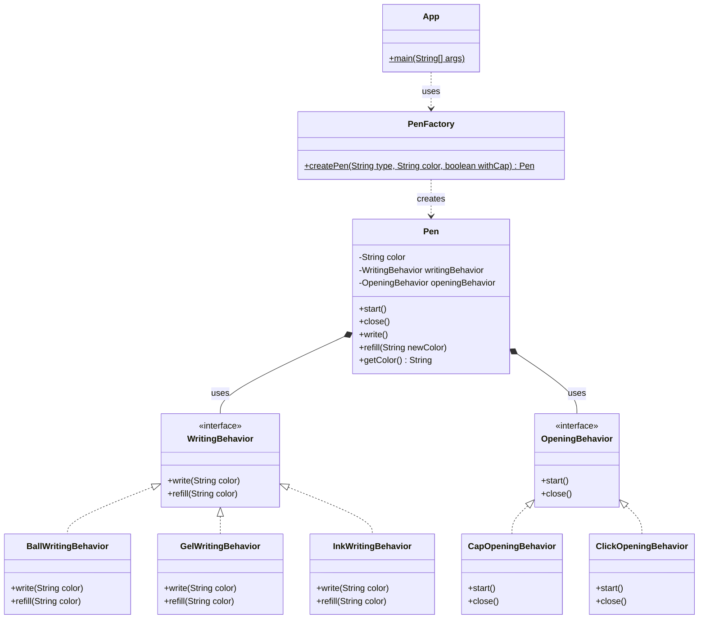

# Pen Modular Framework
A SOLID Java-based design for a multi-trait Pen system constructed via the Strategy and Factory patterns.

## Features Design Support
- A **Pen** natively separates its internal logic into two primary interfaces: `WritingBehavior` and `OpeningBehavior` (Bridged Pattern / Strategy Composition).
- Provides distinct and dynamically loadable rules for how writing and refilling function natively (`Ball`, `Gel`, `Ink`).
- Distinguishes operations for opening/closing the pen cleanly between `Cap` and `Click` styles without subclass generation limits (no `BlueClickBallPen` generated class bloat).
- Driven easily via an extendable `PenFactory`.

## System Architecture Class Diagram



## Running Example 
1. Build code:
```bash
javac -d bin src/behaviors/*.java src/core/*.java src/factory/*.java src/*.java
```

2. Run testing entry point:
```bash
java -cp bin App
```
