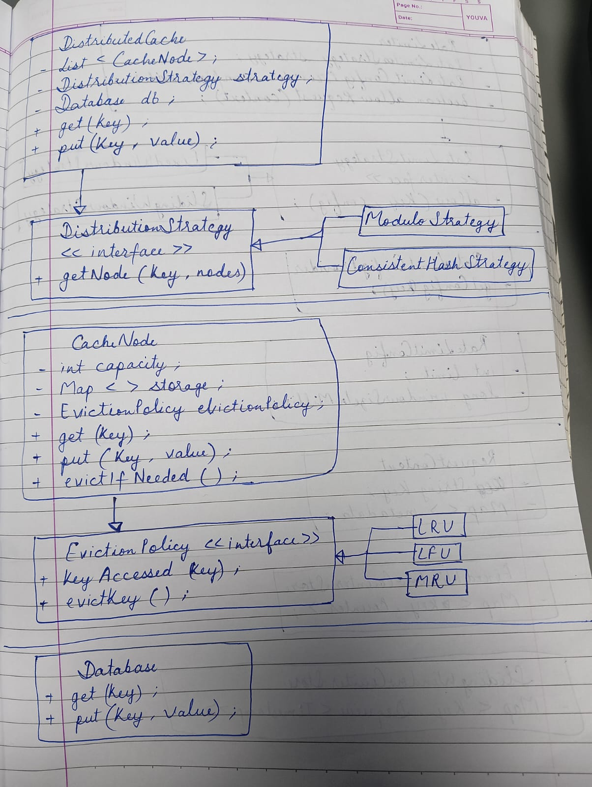

Class Diagram

Core Components
DistributedCache → Entry point (Coordinator)
CacheNode → Individual cache instance
DistributionStrategy → Determines node placement
EvictionPolicy → Handles eviction (LRU, LFU, etc.)
Storage Layer → In-memory / extensible
Database Layer → Fallback source of truth

How It Works
get(key)
Determine node using distribution strategy
Check cache node
If hit → return value
If miss → fetch from DB → update cache → return
put(key, value)
Update DB (write-through)
Route to appropriate node
Store value

Distribution Strategies
Modulo-based (current)
Consistent hashing (future)

Eviction Policies
LRU (Least Recently Used) ✅
LFU (future)
MRU (future)

Design Principles
Strategy Pattern
Open/Closed Principle
Separation of Concerns
Dependency Injection
