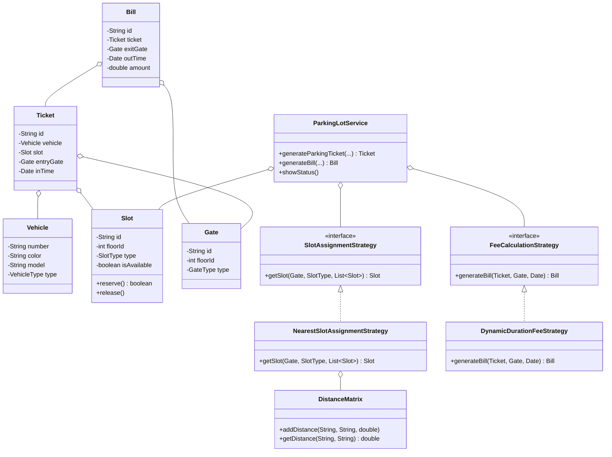

# Multi-Level Parking Lot LLD

An Object-Oriented design implementation of a Multi-Level Parking Lot system accommodating scalable architectural concepts like Strategy Patterns & Thread-Safe Resource Locking.

## Features Design Support
- A **ParkingLotService** controlling entry-exit APIs.
- Accommodates N floors and N gates simultaneously across 3 sizing structures (`SMALL`, `MEDIUM`, `LARGE`).
- Resolves the "Nearest physical slot" routing automatically through an intelligent **DistanceMatrix** mapping algorithm.
- Robust concurrent thread safety via object-level intrinsic locks (`synchronized` block upon `Slot` instances) avoiding severe global bottlenecks while protecting identical slot reservations.
- Extensible fee-calculation logic via implemented behavior strategies.

## System Architecture Class Diagram



## Running Example 
1. Build code:
```bash
javac -d bin src/models/*.java src/services/*.java src/strategies/*.java src/*.java
```

2. Run testing entry point (includes simulated Multi-Threading Concurrency check):
```bash
java -cp bin App
```
