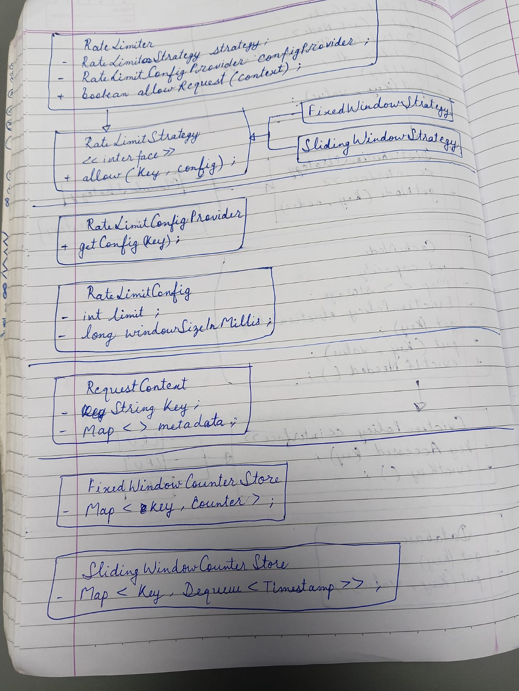

Here is the class diagram,

Supported Algorithms

1. Fixed Window Counter
   Divides time into fixed windows
   Simple and memory efficient
   May allow bursts at window boundaries
2. Sliding Window Counter
   Maintains rolling window
   More accurate rate limiting
   Higher memory usage

Architecture
RateLimiter (Facade) → Entry point for clients
RateLimitStrategy → Pluggable algorithms
ConfigProvider → Dynamic configuration per key
Store Layer → Abstracts storage (in-memory)

How It Works
Business logic determines if external call is needed
Rate limiter is invoked
If allowed → external API is called
If denied → request is rejected or handled gracefully

Design Principles
Strategy Pattern
Open/Closed Principle
Single Responsibility Principle
Dependency Injection
