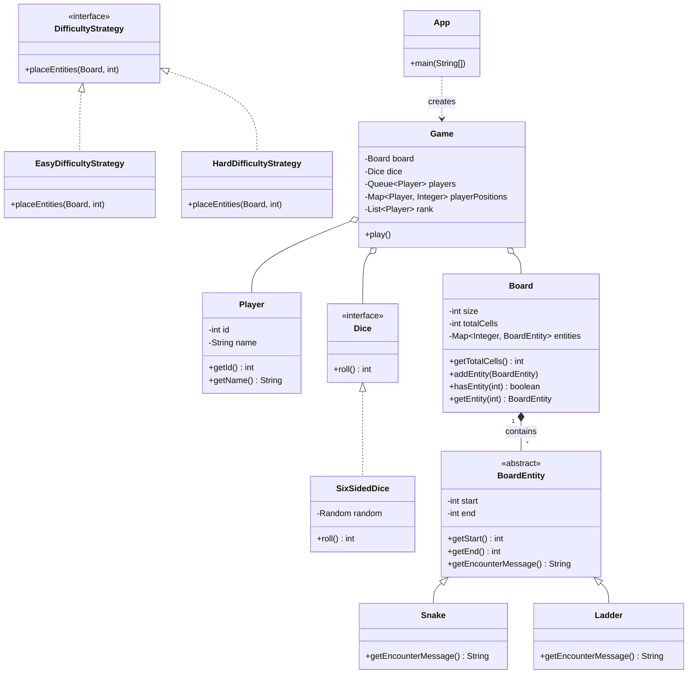

# Snakes and Ladders

A console-based Snake and Ladder application built in Java, making use of Object-Oriented Design principles and Design Patterns such as the Strategy Pattern.

## Features
- Dynamic board size `n x n`.
- `x` number of players rolling a six-sided dice.
- Game operates turn-by-turn.
- `n` snakes and `n` ladders are placed randomly without cycles based on the selected difficulty.
- Contains two difficulty levels: `easy` and `hard`.
- Handles edge cases where a player over-rolls the required amount to reach the final position (the player stays in place).
- The game loop ensures the game stops once `x-1` players finish and reaches the last cell.

## Class Diagram



## Setup and Execution

1. Build the source code:
```bash
javac -d bin src/models/*.java src/entities/*.java src/strategies/*.java src/*.java
```

2. Run the application:
```bash
java -cp bin App
```

3. Provide inputs for board size (`n`), player count (`x`), and difficulty (`easy` or `hard`).
